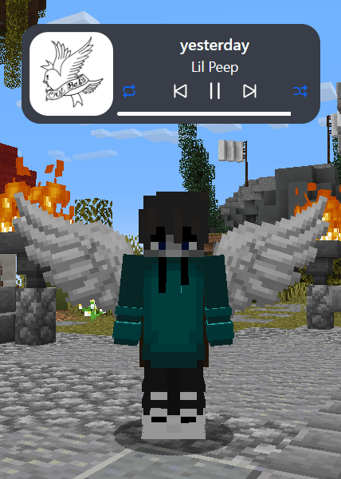
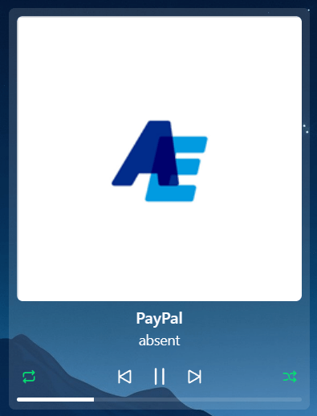
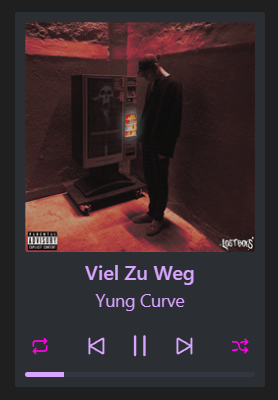
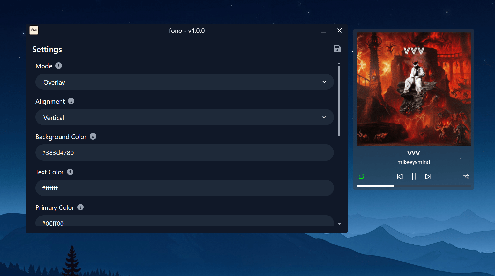

# fono

   

fono is a simple, yet customizable widget to display the currently playing media using the Windows Media Control API. The project was built using [Tauri](https://tauri.app/) with [Vite](https://vite.dev/) and currently only supports Windows.

## Screenshots

  
  
  

## Features

- [x] Display media from multiple sources (e.g. Spotify, YouTube Music, etc.)
- [x] Display album art and progress
- [x] Manipulate playback state
- [x] Prioritize a specific media source
- [x] Use as an overlay (as seen in the first screenshot) or a desktop widget
- [x] Highly customizable appearance
- [x] Auto start with Windows
- [ ] Dynamic theming based on album art (coming soon)

## Usage

### Installation

Grab the latest release from [Releases](https://github.com/liqki/fono/releases/latest).

_When using Spotify, make sure to enable the "Show desktop overlay when using media keys" option in the Spotify settings._

### Configuration

Configuration is done through a separate settings window. You can open it by right-clicking the tray icon and selecting "Settings" or simply double-clicking the tray icon.

  

The settings are saved by clicking the save icon in the top right corner. Some settings may require an automatic restart to take effect.

#### Options

| Setting          | Type    | Description                                                                                                    |
| ---------------- | ------- | -------------------------------------------------------------------------------------------------------------- |
| Mode             | Select  | Determines if the widget is display above or below all other apps.                                             |
| Alignment        | Select  | Determines if the widget is displayed horizontally or vertically.                                              |
| Background Color | Hex     | The background color of the widget. The opacity can be specified after the hex code (f.e. #FFFFFF20).          |
| Text Color       | Hex     | The text color used for the widget.                                                                            |
| Primary Color    | Hex     | The color used for the repeat mode and shuffle icons.                                                          |
| Border Radius    | Number  | The border radius of the widget.                                                                               |
| Width            | Number  | The width of the widget.                                                                                       |
| Height           | Number  | The height of the widget.                                                                                      |
| Icon Style       | Select  | The style of the icons displayed in the widget. None means no icons will be displayed.                         |
| Preferred App    | Text    | The app to prioritize if there is more than one media session. This setting requires a restart to take effect. |
| Lock Widget      | Boolean | Whether the widget should be locked in place and not draggable.                                                |
| Auto Start       | Boolean | Whether fono should automatically start with Windows. This setting requires a restart to take effect.          |

## Contributing

Contributions are welcome! If you have any suggestions or find any bugs, feel free to open an issue or submit a pull request. To contribute, follow these steps:

1. Fork the repository
2. Clone the repository
3. Install dependencies with `bun install`
4. Run the app in dev mode with `bun tauri dev`
5. Make your changes
6. Commit your changes
7. Push your changes to your fork
8. Open a pull request

## License

This project is licensed under the MIT License - see the [LICENSE](LICENSE) file for details.
